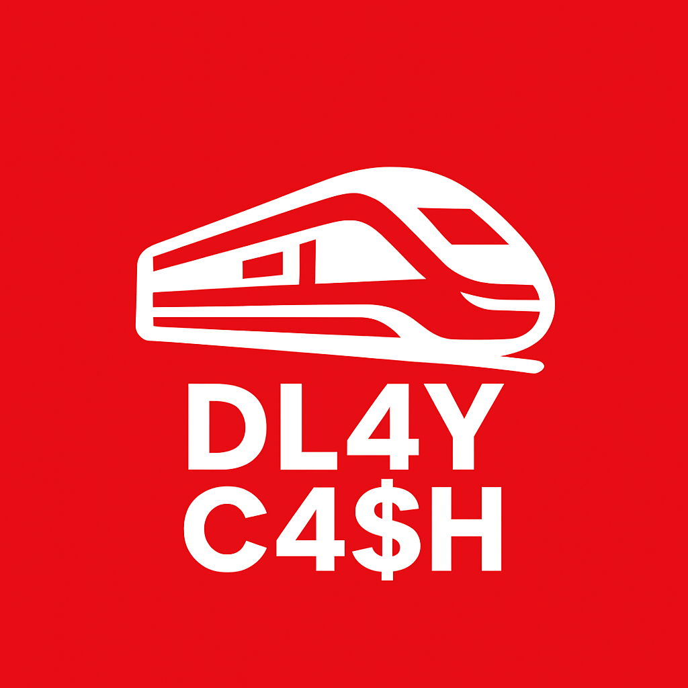

# DL4Y C4$H

An application that predicts future delays of train connections in Germany. Based on these predictions, the application provides an overview of adjusted prices for the connections, calculated according to the refund rules of the DB (Deutsche Bahn - German Railway).

----
## Description

Many train travelers in Germany face frequent delays and often do not reach their destination on time. However, for some travelers, the primary concern is not the delay itself but the rising ticket prices of Deutsche Bahn.

This application helps train travelers by providing adjusted prices for train connections based on predicted delays. If a train exceeds a certain delay threshold, travelers can get refunds from DB according to their compensation rules. The app therefore enables users to make informed and cost-efficient travel decisions.

In a first step, the required data is imported... (API, dataset of historical data, weather data). After cleaning the data, previously trained machine learning algorithms are applied to predict the delay for the train connection. The results are display in (???) and users can retrieve detailed information on the prediction.

----
## Functionalities

### Data Sources and Retrieval

Will your data be sourced
- From an open dataset (eg. kaggle, data paper,...)
- Collected from an API or a Webcrawler
- From your own research

Reference your data source(s) as well as any tools you will use to collect it, such as API libraries, conversion tools etc.

### Data Storage and Handling
**Storage**  
Our project uses a hybrid storage approach, depending on the type of data:
  1. Train data
     - We use a SQLite database as the primary storage system.
     - Allows structured storage of train, station, and delay data
     - Supports efficient queries for filtering, sorting, joining, and aggregation
     - Required package: sqlite3
  
  2. Debugging and processing logs
     - Errors and system events will be captured in simple text or CSV log files.
     - Required tools: open(), csv, datetime (for timestamps)

**Handling**  
To load, process, and analyze our data, we use several Python libraries:
1. NumPy: Used for numerical operations.
2. Pandas: Used for tabular data handling, transformations, and preparing data for visualizations.
3. Lambda functions: Used for filtering and sorting operations.

This combination allows us to handle incoming API data, transform it, store it, and later analyse it for visualizations and reporting.

### Interface

**Web app with streamlit**  
We plan on building a web app with streamlit with the corresponding streamlit package.

The app will integrate with the other libraries used throughout the project, including:
- pandas for data manipulation and analysis
- numpy for numerical operations
- sqlite3 for database access

This approach ensures a seamless connection between our data storage, analysis, and user-facing interface.

### Statistical Analysis

In order to generate reliable predictions for future train delays, we apply a combination of exploratory data analysis (EDA), feature engineering, and machine learning evaluation techniques.

**Data Cleaning**  
Data cleaning includes filtering the data, selecting relevant cases, and handling missing values (using **pandas** and **numpy**).

**Exploratory Data Analysis (EDA)**  
Before modeling, the dataset will be examined to get an impression of the data, detect anomalies, and identify relevant correlations. This includes for example:  
- Descriptive statistics (using **pandas**, **numpy**)  
- Correlation analysis (using **pandas**, **scipy**)  
- Visual analysis (using **matplotlib**)  

**Feature Engineering**  
Based on EDA results, features influencing the delay of a train will be constructed or transformed. Examples include:  
- Aggregated historical data on train delays  
- Derived weather indicators for a given time frame  
- Categorization of variables  
Feature engineering will be supported by **pandas**, **numpy**, and model-preprocessing tools from **scikit-learn**.

**Modeling and Evaluation**  
The application uses machine learning models (e.g., Decision Tree, Random Forest, or Gradient Boosting) to predict expected delays or probabilities of surpassing a certain delay threshold.  
The model performance will be evaluated with appropriate statistical metrics, such as:  
- Mean Absolute Error and Root Mean Squared Error  
- Accuracy, Precision and Recall  
- Cross-validation  
These models will be implemented and tested with **scikit-learn** or **LightGBM**.

**Application**  
After evaluating the different modeling options, the “best” models will be selected. These models are then applied to data chosen by the users (specific train connections). Uncertainty measures, such as prediction intervals for point estimates or classification probabilities, will be displayed in the web app as well.

----
### Table for self-check

| Category                     | Details                                                                           | Mark with ✔️ |
|:-----------------------------|:----------------------------------------------------------------------------------|--------------|
| 1. Source                    | High-quality dataset                                                              |     ...      |
|                              | Quality control / cleaning                                                        |              |
| 2. Data Storage and Handling | Management system                                                                 |              |
|                              | No plaintext passwords                                                            |              |
| 3. Interface                 | CLI, GUI or Web interface for users                                               |              |
|                              | Extensive interface functions (account management, queries, analysis, help)       |              |
| 4. Statistical Analysis      | Interactive statistics area                                                       |              |
|                              | Basic statistics                                                                  |              |
| Always mandatory             | Project proposal with incorporated feedback from tutor                            |              |
|                              | GitHub repo with sensible commit messages, template README, contributions section |              |
|                              | Frequent commenting                                                               |              |
|                              | Docstrings for every function/class                                               |              |
|                              | Testing of relevant functionalities to avoid crashing                             |              |
|                              | Help page for system                                                              |              |
|                              | Milestone presentation                                                            |              |
|                              | AI-Usage Cards                                                                    |              |

----
## How to Install

tbd

----
## How to Use

tbd

----
## Timeline

| Task             | 11/24/2025 | 12/01/2025 | 12/08/2025 | 12/15/2025 | 01/05/2026 | 01/12/2026 | 01/19/2026 | 01/26/2026 | 02/02/2026 | 02/09/2026 |
|-----------------|:----------:|:----------:|:----------:|:----------:|:----------:|:----------:|:----------:|:----------:|:----------:|:----------:|
| Data Gathering  | X          | X          | X          | X          |            |            |            |            |            |            |
| Data Cleaning   |            | X          | X          | X          | X          | X          |            |            |            |            |
| Analysis        |            |            | X          | X          | X          | X          | X          |            |            |            |
| UI Design       |            |            |            |            | X          | X          | X          | X          | X          |            |
| Refactoring     |            |            |            |            |            | X          | X          |            |            |            |
| Presentation    |            |            |            |            | X          | X          | X          | X          | X          | X          |

----
## Group Details

Group information:
- Group name: TBA 
- Group code: G08
- Group repository: https://github.com/bjarneh22/TBA_project
- Tutor responsible: Constantin Dallinghaus 
- Group team leader: Jakob Erhard (jakob.erhard01@stud.uni-goettingen.de)
- Group members: Jakob Erhard, Bjarne Herbst, Eduard Unruh

Contribution of each group member:

**Jakob Erhard (Data Analysis)**: Development, implementation, and testing of machine learning models

**Bjarne Herbst (Backend & API)**: 

**Eduard Unruh (Storage & Data Management)**: Design and implementation of data storage, including database structure, management of train data, and ensuring efficient data processing and access

**All (Frontend & UI)**: Development of the web application, including user interface design and integration of statistical results.

----
## Acknowlegdments

### Libraries
- pandas
- numpy
- sqlite3
- streamlit

### Inspirations and Similar Projects
- https://bahnvorhersage.de/
- tbd

### References
- tbd
- tbd
